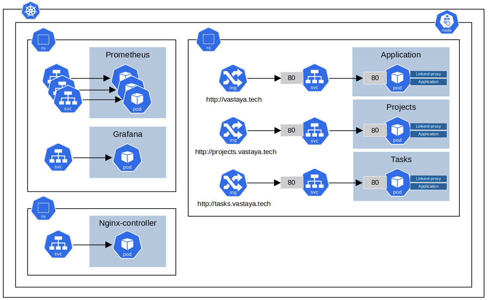
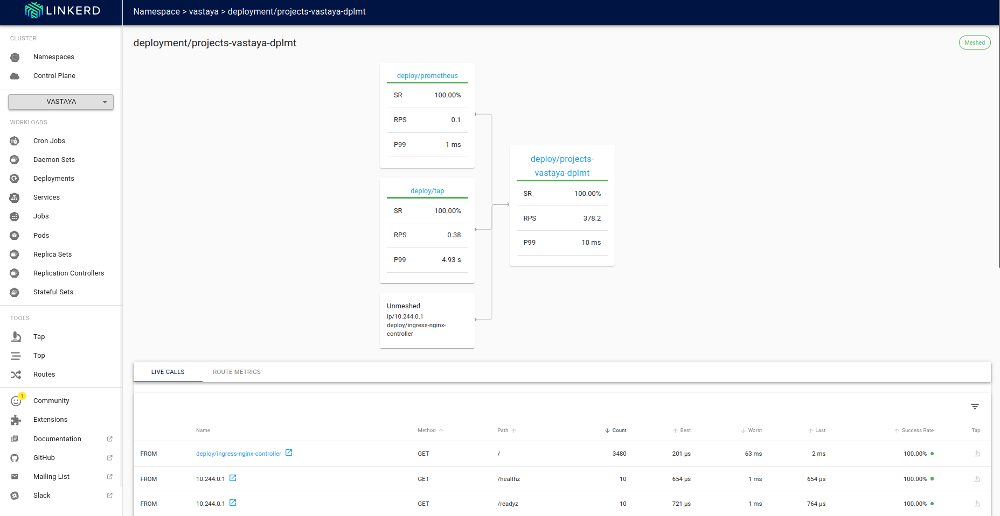

# Environment Configuration and Deployment Guide
This guide provides step-by-step instructions for setting up and deploying an application using Minikube with various drivers and container runtimes, including Docker and Podman. It also covers deployment using Helm for Kubernetes.


## Architecture
The application architecture is composed of the following components:
**React.JS Application:**This is the user interface (UI) that allows users to view projects and manage tasks (e.g., opening and closing tasks). The React.JS application will be deployed using a shared Helm chart, and it will consist of:
- **Cluster IP Service:** Provides internal access within the cluster.
- **Ingress with NGINX:** Manages external access and routing.
- **Deployment:** This will deploy one single replica that will host the React.JS application isntance.
- **Namespace:** All resources will be deployed onto the same namespace.

**Note:** Since the React.JS is a client application, API endpoints must be accessed using the host specified in their Ingress configurations. The APIs will not be accessible via internal cluster DNS resolution.

**NodeJS API (Projects):** This API manages project data in memory and supports CRUD (Create, Read, Update, Delete) operations. It also interacts with the internal endpoint of the Tasks service to generate reports for specific projects. Deployment will be managed via a shared Helm chart and will include:
- **Cluster IP Service:** Facilitates internal communication within the cluster.
- **Ingress with NGINX:** Handles external requests and routing.
- **Deployment:** This will deploy one single replica that will host the NodeJS API for project management.
- **Namespace:** All resources will be deployed onto the same namespace.

**NodeJS API (Tasks):** This API manages task data in memory and supports CRUD operations. It communicates with the internal endpoint of the Projects service to update project statuses based on task progress. The deployment will be carried out using a shared Helm chart and will include:
- **Cluster IP Service:** Provides internal access for communication within the cluster.
- **Ingress with NGINX:** Manages external routing and access.
- **Deployment:** This will deploy one single replica that will host the NodeJS API for task management.
- **Namespace:** All resources will be deployed onto the same namespace.



## Minikube Setup
### Using Podman
Configure Minikube to use Podman as the driver and CRI-O as the container runtime:
```
# minikube config set rootless true 
# minikube config set driver podman
minikube start --driver=podman --container-runtime=cri-o
eval $(minikube podman-env)
```
### Using Docker
Configure Minikube to use Docker as the driver and Docker as the container runtime:
```
# minikube config set rootless true
# minikube config set driver docker
minikube start --driver=docker --container-runtime=docker
eval $(minikube docker-env)
```
**Note**: If you are using multiple terminal, remember to execute `eval $(minikube docker-env)` on each of them to point to the right repository.
**Note:** If you encounter the error could not read CA certificate `/home/hero/.minikube/certs/ca.pem: open /home/hero/.minikube/certs/ca.pem: permission denied.`, resolve it by modifying the AppArmor profile:
```
sudo bash -c 'echo "owner @{HOME}/.minikube/certs/* r," >> /var/lib/snapd/apparmor/profiles/snap.docker.docker'
sudo apparmor_parser -r /var/lib/snapd/apparmor/profiles/snap.docker.docker
```
## Ingress Setup
The application utilizes multiple Ingress resources to expose services outside the Kubernetes cluster. The chosen Ingress controller is NGINX. To install it, first add the NGINX Ingress Helm repository and install the controller using the following commands:
```
helm repo add ingress-nginx https://kubernetes.github.io/ingress-nginx
helm repo update
helm install ingress-nginx ingress-nginx/ingress-nginx
```
Next, create a route to the services deployed with the LoadBalancer type and update the `/etc/hosts` file to resolve domain names locally:
```
minikube tunnel --alsologtostderr 
kubectl get ingress application-ingress -o jsonpath='{.status.loadBalancer.ingress[0].ip}' | xargs -I{} sudo sh -c 'echo "{} vastaya.tech" >> /etc/hosts'
```

## Development
First, you need to configure the environment variables in the `.env` file. Replace the Kubernetes-specific values with localhost URLs for local development. For example:
```
# Kubernetes Configuration (comment out for local development)
# REACT_APP_USERS_API_URL=http://users.vastaya.tech
# REACT_APP_PROJECTS_API_URL=http://projects.vastaya.tech
# REACT_APP_TASKS_API_URL=http://tasks.vastaya.tech

# Local Development Configuration
REACT_APP_USERS_API_URL=http://users.vastaya.tech
REACT_APP_PROJECTS_API_URL=http://localhost:8081
REACT_APP_TASKS_API_URL=http://localhost:8082
```
After updating the `.env` file, you can start the application with the following commands:
1. Start the React.JS Application:
```
cd ~/application/src
yarn install
yarn start
```
2. Start the APIs:
```
cd ~/apis/projects/src
npm install
npm start
```
This setup will ensure that your React.JS application and APIs are correctly configured for local development.

## Deployment
### Podman
Build the Podman image:
```
cd ~/application
podman build --tag application:latest .
```
Test the Podman image:
```
podman run application:latest -p 8080:80
```
### Docker
Build the Docker image:
```
cd ~/application
docker build --tag application:latest .
```
Test the Docker image:
```
docker run application:latest -p 8080:80
```
**Note:** If you encounter the error `Error: creating build container: short-name nginx:alpine did not resolve to an alias and no unqualified-search registries are defined in /etc/containers/registries.conf`, update the registries.conf file:
```
sudo bash -c 'echo "unqualified-search-registries = [\"docker.io\"]" >> /etc/containers/registries.conf'
```
## Helm
Once the image is build, you can install the helm chart using the image in the Kubernetes cluster
```
cd ~/application
helm install application --values ./helm/values.yaml ../helm/ --create-namespace --namespace vastaya
```
**Note**: Since each API will have its own host, you’ll need to update the `/etc/hosts` file accordingly:
```
kubectl get ingress application-ingress -o jsonpath='{.status.loadBalancer.ingress[0].ip}' | xargs -I{} sudo sh -c 'echo "{} projects.vastaya.tech" >> /etc/hosts'
```

## Automation
### Bots
The `/bot` directory contains several Kubernetes Job and CronJob resources designed to simulate traffic to the application for demonstration purposes. To deploy these resources, navigate to the /bots directory and apply the configurations:
```
cd ~/bots
kubectl apply -f .
```

## Monitoring
To monitor CPU and memory usage, you can install Prometheus and Grafana. These tools will help you gather and visualize metrics from your Kubernetes cluster.
### Prometheus
Prometheus is a powerful monitoring and alerting toolkit. To install Prometheus using Helm, follow these steps:
1. Add the Prometheus Helm repository:
```
helm repo add prometheus-community https://prometheus-community.github.io/helm-charts
helm repo update
```
2. Install Prometheus:
```
helm install prometheus prometheus-community/prometheus --create-namespace --namespace monitoring
```
3. Access Prometheus via port-forward: To view the Prometheus server, forward its port to your local machine:
```
export POD_NAME=$(kubectl get pods --namespace monitoring -l "app.kubernetes.io/name=prometheus,app.kubernetes.io/instance=prometheus" -o jsonpath="{.items[0].metadata.name}")
kubectl --namespace monitoring port-forward $POD_NAME 9090
```
Nou can now access Prometheus at http://localhost:9090.

### Grafana
Grafana provides powerful visualization capabilities for your metrics. To install Grafana using Helm, follow these steps:
1. Add the Grafana Helm repository:
```
helm repo add grafana https://grafana.github.io/helm-charts
helm repo update
```
2. Install Grafana:
```
helm install grafana grafana/grafana --create-namespace --namespace monitoring
```
3. Access the Grafana dashboard: 
- First, retrieve the admin password:
```
kubectl get secret --namespace monitoring grafana -o jsonpath="{.data.admin-password}" | base64 --decode ; echo
```
- Then, forward the Grafana port to your local machine:
```
export POD_NAME=$(kubectl get pods --namespace monitoring -l "app.kubernetes.io/name=grafana,app.kubernetes.io/instance=grafana" -o jsonpath="{.items[0].metadata.name}")
kubectl port-forward $POD_NAME 3000
```
You can now access Grafana at http://localhost:3000.

4. Configure Grafana to use Prometheus as a data source:
- Log in to Grafana using the retrieved admin password.
- Navigate to Configuration (gear icon) → Data Sources.
- Click Add data source.
- Select Prometheus.
- Enter the following URL for the Prometheus server:
```
http://prometheus-server.monitoring.svc.cluster.local
```
- Save and test the configuration.
This setup will allow you to monitor your application's CPU and memory usage effectively, and visualize the collected metrics using Grafana dashboards.

## Service Mash

### Linkerd
There are two primary ways to install Linkerd as a service mesh: via Helm charts or the Linkerd CLI. In this project, I will use Helm charts for installation and the Linkerd CLI to inject the proxy. A prerequisite for installing Linkerd using Helm, as opposed to the CLI, is the creation of certificates for mutual TLS (mTLS). For certificate management, I will utilize `step`.
**Note:** The certificate issuer must be an intermediate Certificate Authority (CA).

To install `step` and create the required certificates:
```
wget https://dl.smallstep.com/cli/docs-cli-install/latest/step-cli_amd64.deb
sudo dpkg -i step-cli_amd64.deb
step certificate create root.linkerd.cluster.local ca.crt ca.key --profile root-ca --no-password --insecure
step certificate create identity.linkerd.cluster.local issuer.crt issuer.key --profile intermediate-ca --not-after 8760h --no-password --insecure --ca ca.crt --ca-key ca.key
```
Next, let's install the Linkerd CLI
```
curl --proto '=https' --tlsv1.2 -sSfL https://run.linkerd.io/install | sh
export PATH=$HOME/.linkerd2/bin:$PATH
```
To install Linkerd on your Kubernetes cluster using Helm, you will need to install two separate charts in succession: [linkerd-crds](https://artifacthub.io/packages/helm/linkerd2/linkerd-crds) and [linkerd-control-plane](https://artifacthub.io/packages/helm/linkerd2/linkerd-control-plane). Additionally, since the nodes in this cluster use the Docker container runtime, the proxy-init container must run with root privileges.
```
helm repo add linkerd https://helm.linkerd.io/stable
helm repo update
helm install linkerd-crds linkerd/linkerd-crds -n linkerd --create-namespace
helm install linkerd-crds linkerd-edge/linkerd-crds -n linkerd --create-namespace
helm install linkerd-control-plane linkerd-edge/linkerd-control-plane -n linkerd --create-namespace --set-file identityTrustAnchorsPEM=certificates/ca.crt --set-file identity.issuer.tls.crtPEM=certificates/issuer.crt --set-file identity.issuer.tls.keyPEM=certificates/issuer.key --set runAsRoot=true
```
**Note:** The stable version of Linkerd does not include the `externalworkloads.workload.linkerd.io` CRD, which may cause the `linkerd check` command to fail, as it checks components based on the edge release. To resolve this, you can manually install the missing CRD by generating the manifest with the command `linkerd install --crds`, copying the CRD definitions into a YAML file, and deploying it manually.

Once installed, you can apply Linkerd to Kubernetes resources by adding specific annotations. 
```
kubectl get -n vastaya deploy -o yaml | linkerd inject - | kubectl apply -f 
```
Next, install the Linkerd [Viz extension](https://artifacthub.io/packages/helm/linkerd2-edge/linkerd-viz) for monitoring and observability.
```
helm install linkerd-viz linkerd/linkerd-viz --create-namespace --namespace linkerd-viz 
```
After installation, it's recommended to restart your application deployments to ensure that the Viz extension can fully set up **tap**, which allows users to introspect live traffic.
```
kubectl rollout restart deployment/projects-vastaya-dplmt -n vastaya
```
Finally, you can access the Linkerd Viz dashboard, which provides a visual interface to the collected metrics, allowing you to monitor live traffic and the health of your services.
**Note:** In the following screenshot, I simulated a surge in traffic to the projects API to evaluate its scalability and responsiveness.
```      
linkerd viz dashboard
```



<!-- # Prerequisites
**MySQL Operator**
The documentation is available at the following [link](https://dev.mysql.com/doc/mysql-operator/en/mysql-operator-innodbcluster.html)
```
helm repo add mysql-operator https://mysql.github.io/mysql-operator
helm repo update
helm install mysql-operator mysql-operator/mysql-operator -n mysql-operator --values values.yaml --create-namespace
helm install mysql-cluster mysql-operator/mysql-innodbcluster --set tls.useSelfSigned=true --values values.yaml -n default
```
# Create test DB
```
 kubectl run --rm -it myshell --image=container-registry.oracle.com/mysql/community-operator -- mysqlsh
If you don't see a command prompt, try pressing enter.

 MySQL  SQL > \connect root@mysql-cluster
Creating a session to 'root@mysql-cluster'
Please provide the password for 'root@mysql-cluster': ******
Save password for 'root@mysql-cluster'? [Y]es/[N]o/Ne[v]er (default No): yes
Fetching global names for auto-completion... Press ^C to stop.
Your MySQL connection id is 0
Server version: 9.0.1 MySQL Community Server - GPL
No default schema selected; type \use <schema> to set one.
 MySQL  mysql-cluster:3306 ssl  SQL > CREATE DATABASE testdb;
  MySQL  mysql-cluster:3306 ssl  SQL > CREATE TABLE IF NOT EXISTS users (
                                   ->   id INT AUTO_INCREMENT PRIMARY KEY,
                                   ->   name VARCHAR(255) NOT NULL,
                                   ->   email VARCHAR(255) NOT NULL UNIQUE
                                   -> );
ERROR: 1046 (3D000): No database selected
 MySQL  mysql-cluster:3306 ssl  SQL > USE testdb;
Default schema set to `testdb`.
Fetching global names, object names from `testdb` for auto-completion... Press ^C to stop.
 MySQL  mysql-cluster:3306 ssl  testdb  SQL > CREATE TABLE IF NOT EXISTS users (
                                           ->   id INT AUTO_INCREMENT PRIMARY KEY,
                                           ->   name VARCHAR(255) NOT NULL,
                                           ->   email VARCHAR(255) NOT NULL UNIQUE
                                           -> );
Query OK, 0 rows affected (0.0515 sec)
 MySQL  mysql-cluster:3306 ssl  testdb  SQL > INSERT INTO users (name, email) VALUES ('John Doe', 'johndoe@example.com');
Query OK, 1 row affected (0.0088 sec)
 MySQL  mysql-cluster:3306 ssl  testdb  SQL > SELECT * FROM users;
+----+----------+---------------------+
| id | name     | email               |
+----+----------+---------------------+
|  1 | John Doe | johndoe@example.com |
+----+----------+---------------------+
1 row in set (0.0007 sec)
 MySQL  mysql-cluster:3306 ssl  testdb  SQL > quit -->
```